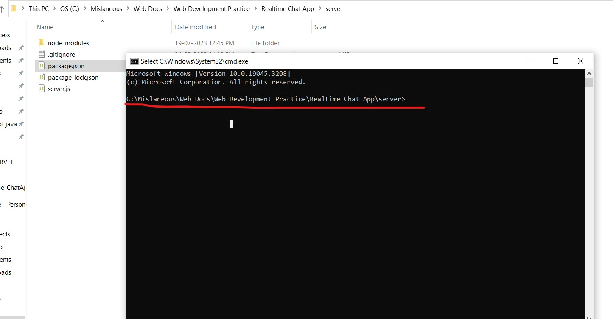

# Realtime ChatApp
 User can chat via connecting a room using unique string and they have access to that particular room chats

##Installation Steps

**Step-1**

Download the zip file from the code repo and install it in a seperate folder

**Step-2**
Head inside the folder and then head to client folder (i.e. yourfolder/client)

**Step-3**
Now open the command prompt inside that folder you can do this by typing the string cmd in the file explorer taskbar.

**Step-4**
Run two commands step by step which are mentioned below
1) npm install
2) npm run dev

(Note- DO NOT CLOSE THE COMMAND PROMPT AFTER YOU RAN THE COMMANDS)
(Note - At this point website will be up but dont use it before you start the server)

**Step-5**
Repeat the cmd process same as for the client folder, go to server folder and open cmd and run the commands below

1)npm install
2)npm run start

YAY! we are up and running
(Note- DO NOT CLOSE THE COMMAND PROMPT AFTER YOU RAN THE COMMANDS)

At this point you have two command prompts running in your system and now you can access the web app

##App Essentials
1. You will see a login screen to join the room you wish you can add your username and room name to join the room for example (John, myroom).
2. After successfull join of a room you will be redirected to /chatroom url where you can access the chat
3. In order to make the other person join the room he/she needs to use the same string that was used by the first person which is "myroom" in this case.
4. As you click the create room with the same string , you are joined and up to use the chat
5. Feature like bold, italics, strikethrough, bullets, numbering etc were applied to the chat.

NOTE- In order to use bullets and numbers your text must to be have in a new line in order for the program to detect the bullets.

###Developer Feedback
It was an amazing experience building this app and the challanges I faced during the development of this app made me learn new solutions to problems, I would surely be interested to learn more and make a strong foundation in react, thank you for the opportunity, i would continue working on this project as this could add me in experience.

####What does the app not capable of?
1) *Hyperlink*
I was failed to achieve the hyperlink button as my plan was to dynamically insert the a tag inside the textarea which is not supported.

2) *File upload*
I was successfull in achieving the file from the frontend to backend in a buffer and saved it inside the backend but i was unable to transmit it again to another user

3) *Mentions*
I was successfull in getting the id of users that are particularly connected to the room but was unable to get the name of user

##Conclusion
I learned a lot while having a week journey on this project and I would work on this more to make all the buttons work as expected to add it in my projects , Thank you so much for your time, I hope i did best on the react part of the App, Thanks!